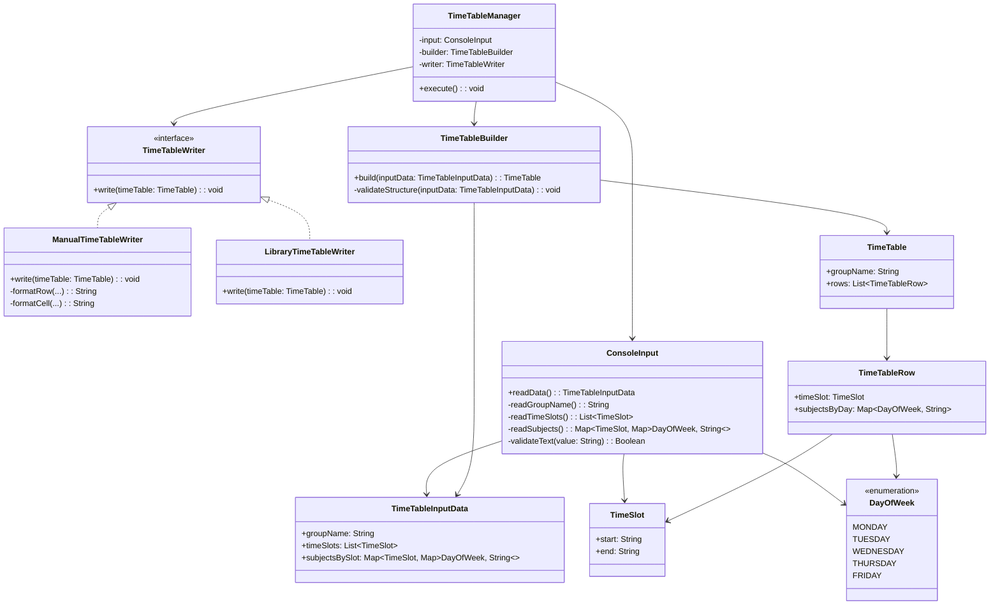
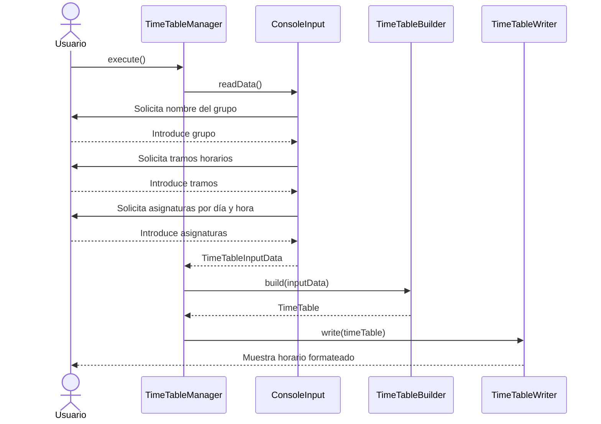
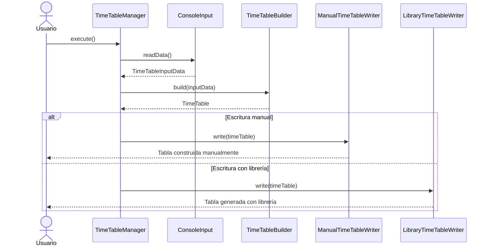

# Actividad_horario_asignaturas


Esa práctica encaja bien con los **CE a, b y c del RA5**, porque obliga al alumnado a:

* **leer datos por consola**,
* **dar formato a la salida**,
* y **usar correctamente los mecanismos de entrada/salida del lenguaje**.

---

# Práctica: Generador de horario de clase por consola

## Descripción de la práctica

Desarrolla una aplicación en **Kotlin** que permita introducir por teclado la información básica de un **horario semanal de clase** y que, una vez recogidos los datos, la muestre de forma **ordenada, alineada y con formato de tabla** en la consola.

El objetivo de la práctica es trabajar la **entrada de datos por teclado** y la **salida formateada en consola**, de manera que el programa no se limite a mostrar texto sin ordenar, sino que presente la información de forma clara, legible y estructurada, como si fuera un pequeño cuadro horario real.

La aplicación deberá pedir al usuario los datos de las asignaturas de una semana lectiva y, con esa información, construir una tabla con los días y las horas de clase.

---

## Qué se pretende evaluar

Con esta práctica se trabajarán especialmente los siguientes criterios de evaluación:

* **CE a)** Uso de la consola para realizar operaciones de entrada y salida de información.
* **CE b)** Aplicación de formatos en la visualización de la información.
* **CE c)** Reconocimiento y uso de las posibilidades de entrada/salida del lenguaje y librerías asociadas.

Dicho de forma más terrenal: aquí no basta con que “funcione”. Tiene que **pedir bien los datos**, **mostrarlos bien** y **hacer un uso correcto de la entrada y salida en consola**. Vamos, que el programa no parezca hecho a martillazos.

---

# Enunciado para el alumnado

## Objetivo

Realiza un programa en Kotlin que solicite por teclado un horario de clase de **lunes a viernes**, con **6 horas al día**, y lo muestre al final en forma de **tabla bien formateada**.

## Funcionamiento general

El programa deberá:

1. Pedir al usuario el nombre del grupo o curso.
2. Pedir los nombres de los tramos horarios.
3. Pedir las asignaturas correspondientes a cada día y a cada hora.
4. Mostrar al final el horario completo en forma de tabla.

---

# Datos que debe leer el programa

Como mínimo, el programa deberá solicitar:

## 1. Nombre del grupo

Por ejemplo:

* 1º DAW
* 1º ASIR
* 2º SMR

## 2. Tramos horarios

Se leerán los **6 periodos lectivos**.
Por ejemplo:

* 08:15 - 09:15
* 09:15 - 10:15
* 10:15 - 11:15
* 11:45 - 12:45
* 12:45 - 13:45
* 13:45 - 14:45

## 3. Asignatura de cada franja

Para cada una de las 6 horas y para cada uno de los 5 días lectivos:

* Lunes
* Martes
* Miércoles
* Jueves
* Viernes

El programa deberá pedir qué asignatura corresponde a cada celda del horario.

Por ejemplo:

* Lunes, hora 1 → Programación
* Lunes, hora 2 → Bases de Datos
* ...
* Viernes, hora 6 → Entornos de Desarrollo

---

# Requisitos

## Requisitos obligatorios

El programa debe cumplir al menos estos requisitos:

* La entrada de datos se realizará **por consola**.
* La salida final debe mostrarse en forma de **tabla alineada**.
* La tabla debe incluir:

  * una cabecera con los días,
  * una primera columna con el tramo horario,
  * y el contenido de cada asignatura en su posición correspondiente.
* Debe mostrarse un título identificando el horario y el grupo.
* La visualización debe ser clara y legible.


Además, sería conveniente que:

* se controlen los espacios para que las columnas queden bien alineadas;
* se utilicen funciones para separar responsabilidades;
* los mensajes al usuario sean claros;
* el código esté bien organizado y sea fácil de leer.

---

# Ejemplo de datos que debería introducir el usuario

A continuación tienes un ejemplo de la información que podría leer el programa.

## Grupo

`1º DAW`

## Tramos horarios

1. `08:15 - 09:15`
2. `09:15 - 10:15`
3. `10:15 - 11:15`
4. `11:45 - 12:45`
5. `12:45 - 13:45`
6. `13:45 - 14:45`

## Asignaturas

### Lunes

* Programación
* Bases de Datos
* Sistemas Informáticos
* Lenguajes de Marcas
* Entornos de Desarrollo
* Programación

### Martes

* Programación
* Programación
* Bases de Datos
* Sistemas Informáticos
* Inglés
* Itinerario Personal

### Miércoles

* Bases de Datos
* Programación
* Programación
* Lenguajes de Marcas
* Sistemas Informáticos
* Entornos de Desarrollo

### Jueves

* Sistemas Informáticos
* Bases de Datos
* Programación
* Programación
* Inglés
* Sostenibilidad

### Viernes

* Lenguajes de Marcas
* Sistemas Informáticos
* Bases de Datos
* Programación
* Entornos de Desarrollo
* Tutoría

---

# Ejemplo de salida esperada

La salida podría tener un aspecto parecido a este:

```text
==============================================================
                 HORARIO DEL GRUPO 1º DAW
==============================================================

+---------------+----------------------+----------------------+----------------------+----------------------+----------------------+
| Hora          | Lunes                | Martes               | Miércoles            | Jueves               | Viernes              |
+---------------+----------------------+----------------------+----------------------+----------------------+----------------------+
| 08:15-09:15   | Programación         | Programación         | Bases de Datos       | Sistemas Informáticos| Lenguajes de Marcas  |
| 09:15-10:15   | Bases de Datos       | Programación         | Programación         | Bases de Datos       | Sistemas Informáticos|
| 10:15-11:15   | Sistemas Informáticos| Bases de Datos       | Programación         | Programación         | Bases de Datos       |
| 11:45-12:45   | Lenguajes de Marcas  | Sistemas Informáticos| Lenguajes de Marcas  | Programación         | Programación         |
| 12:45-13:45   | Entornos de Desarrollo| Inglés              | Sistemas Informáticos| Inglés               | Entornos de Desarrollo|
| 13:45-14:45   | Programación         | Itinerario Personal  | Entornos de Desarrollo| Sostenibilidad      | Tutoría              |
+---------------+----------------------+----------------------+----------------------+----------------------+----------------------+
```

---

# Qué aspectos de formato se esperan

Aquí está la clave del **CE b**. No vale con imprimir datos “uno debajo de otro” sin más. Se espera que el alumnado cuide cuestiones como estas:

* que las columnas tengan un ancho homogéneo;
* que los textos estén alineados;
* que la cabecera se distinga del resto;
* que la tabla sea fácil de leer;
* que los nombres largos no rompan completamente la presentación.

En otras palabras: el programa debe mostrar la información como un **horario**, no como una lista desordenada de supervivencia.

---

# Posible secuencia de lectura de datos

Una forma lógica de pedir los datos sería esta:

1. Pedir nombre del grupo.
2. Pedir los 6 tramos horarios.
3. Para cada tramo horario:

   * pedir asignatura del lunes,
   * pedir asignatura del martes,
   * pedir asignatura del miércoles,
   * pedir asignatura del jueves,
   * pedir asignatura del viernes.
4. Mostrar la tabla final.

Por ejemplo, el programa podría preguntar así:

```text
Introduce el nombre del grupo: 1º DAW

Introduce el horario de la hora 1: 08:15 - 09:15
Asignatura del lunes: Programación
Asignatura del martes: Programación
Asignatura del miércoles: Bases de Datos
Asignatura del jueves: Sistemas Informáticos
Asignatura del viernes: Lenguajes de Marcas
```

Y repetir el proceso para las 6 franjas.

---

# Variante más sencilla

Si quieres que la práctica no se haga demasiado larga, también puedes simplificarla así:

* en vez de pedir 6 tramos horarios escritos por el usuario, los dejas fijos en el programa;
* el alumno solo introduce las asignaturas;
* al final se imprime el horario.

Eso te permite centrar más la práctica en **entrada básica por consola** y **salida formateada**, sin dispersarse demasiado.

---


# Redacción breve para entregar directamente al alumnado

## Práctica: Horario semanal por consola

Desarrolla una aplicación en Kotlin que permita introducir por teclado un horario semanal de clase y mostrarlo al final en forma de tabla bien alineada en consola.

El programa deberá pedir:

* el nombre del grupo,
* los 6 tramos horarios,
* y la asignatura correspondiente a cada día de la semana lectiva (lunes a viernes) en cada una de las 6 horas.

Al finalizar, deberá mostrar el horario completo en formato tabla, con:

* una fila de cabecera con los días,
* una columna inicial con las horas,
* y el nombre de cada asignatura en su posición correspondiente.

Se valorará especialmente:

* el uso correcto de la entrada y salida por consola,
* la claridad de los mensajes,
* y el formato aplicado a la salida final para que la tabla sea legible y ordenada.

Sí, ese diseño está bien planteado y, de hecho, tiene una idea muy sana desde el punto de vista didáctico y de diseño: **separar responsabilidades**.

La clave de tu propuesta es que el programa no mezcle en un mismo bloque:

* la **lectura de datos**,
* la **validación**,
* la **transformación del modelo**,
* y la **presentación del horario**.

Eso hace que el código sea más claro, más mantenible y más reutilizable. Dicho de otra forma: cada clase se dedica a “su parcela” y no mete las manos donde no le toca. Un pequeño milagro de la ingeniería del software.

---

# Descripción mejorada del diseño

La solución se organiza en torno a un flujo en varias etapas, donde cada clase tiene una responsabilidad muy concreta.

## Idea general

El programa sigue este recorrido:

1. **Se arranca la aplicación** desde una clase coordinadora.
2. **Se leen y validan los datos de entrada** introducidos por el usuario.
3. **Se transforman esos datos** en una estructura adecuada para representar el horario.
4. **Se genera la salida** mediante un mecanismo de escritura intercambiable.

Este enfoque permite que la lógica principal del programa no dependa de cómo se muestra el horario. Por tanto, toda la parte de lectura, validación y construcción del modelo puede reutilizarse aunque cambie el modo de presentación.

---

# Responsabilidad de cada elemento

## 1. `TimeTableManager`

Es la clase que **coordina la ejecución** del programa.

No debería contener lógica de negocio compleja ni detalles de formato. Su papel es actuar como director de orquesta:

* crea o recibe las dependencias necesarias;
* invoca la lectura de datos;
* pasa los datos al constructor del horario;
* delega la salida en un escritor concreto.

### Responsabilidad principal

Controlar el flujo general de la aplicación.

### Ventaja

Centraliza la ejecución sin mezclar detalles de entrada, construcción o salida.

---

## 2. `ConsoleInput`

Su responsabilidad es **interactuar con el usuario por consola** para obtener los datos necesarios.

Debe encargarse de:

* pedir los datos al usuario;
* validar que sean correctos en el momento de la lectura;
* construir una estructura inicial con toda la información recogida.

Por ejemplo, aquí tendría sentido validar cosas como:

* que el nombre del grupo no esté vacío;
* que el número de tramos horarios sea el esperado;
* que los textos introducidos no sean nulos ni inconsistentes;
* que los nombres de asignaturas tengan un formato razonable.

### Responsabilidad principal

Capturar y validar los datos de entrada.

### Resultado

Devuelve una estructura de datos “cruda pero válida”, por ejemplo `TimeTableInputData`.

---

## 3. `TimeTableBuilder`

Esta clase toma los datos de entrada ya validados y los transforma en una estructura más adecuada para representar el horario final.

Aquí ya no se trabaja con “lo que el usuario ha escrito” sin más, sino con una estructura que permita:

* acceder cómodamente a las materias por día y tramo horario;
* comprobar que el horario es consistente;
* preparar el modelo para ser pintado por cualquier escritor.

Por ejemplo, el `Builder` podría:

* reorganizar los datos en filas y columnas;
* verificar que hay información suficiente para todas las celdas;
* construir un objeto de dominio como `TimeTable`.

### Responsabilidad principal

Transformar los datos de entrada en un modelo estructurado del horario.

### Resultado

Devuelve una estructura lista para mostrarse, por ejemplo `TimeTable`.

---

## 4. `TimeTableWriter`

Es una **abstracción** para la salida del horario.

La idea es excelente, porque desacopla la lógica del programa del modo concreto en que se presenta el resultado.

En lugar de que el sistema “sepa” directamente cómo pintar el horario, delega ese trabajo en un escritor que implemente la interfaz.

### Responsabilidad principal

Definir el contrato de salida del horario.

### Método principal

* `write(timeTable: TimeTable)`

---

## 5. Implementaciones de `TimeTableWriter`

Aquí es donde entran las variantes.

### `ManualTimeTableWriter`

Genera la tabla manualmente usando cadenas, separadores, alineación y formato.

### `LibraryTimeTableWriter`

Genera la tabla utilizando una librería externa especializada en tablas o formateo en consola.

### Ventaja de este enfoque

Permite cambiar la forma de presentación sin tocar ni la lectura, ni la validación, ni la construcción del modelo.

Eso es precisamente lo que hace que el diseño sea flexible y extensible.

---

# Valor didáctico del diseño

Este diseño es especialmente bueno para trabajar con alumnado porque permite explicar de forma muy clara varios principios importantes:

## Separación de responsabilidades

Cada clase hace una cosa concreta.

## Bajo acoplamiento

La forma de mostrar el horario no afecta al resto del sistema.

## Alta cohesión

Cada clase agrupa comportamientos relacionados entre sí.

## Abierto a extensión

Se pueden añadir nuevos escritores sin modificar la lógica ya existente.

Por ejemplo, mañana podrías añadir:

* un `HtmlTimeTableWriter`,
* un `CsvTimeTableWriter`,
* un `JsonTimeTableWriter`.

Y el resto del sistema seguiría igual de tranquilo, sin sufrir un drama existencial.

---

# Posible mejora conceptual del diseño

Tu propuesta ya es buena, pero yo dejaría más claros los **objetos de datos** que circulan entre las clases. Por ejemplo:

* `TimeTableInputData`: datos leídos desde consola.
* `TimeTable`: modelo final del horario.
* `TimeSlot`: franja horaria.
* `DayOfWeek`: días lectivos.
* `ClassEntry`: asignatura en una celda del horario.

Esto hace el diseño más expresivo y ayuda mucho a que el alumnado entienda qué representa cada cosa.

---

# Diagrama de clases en Mermaid

Te propongo este diagrama, algo más completo y limpio:



---

# Explicación del diagrama de clases

En este diagrama:

* `TimeTableManager` depende de tres colaboradores:

  * uno para leer,
  * otro para construir,
  * y otro para escribir.

* `ConsoleInput` devuelve un `TimeTableInputData`, que representa los datos recogidos desde consola.

* `TimeTableBuilder` transforma ese objeto en un `TimeTable`, que ya es el modelo preparado para mostrar.

* `TimeTableWriter` define el contrato común para cualquier estrategia de salida.

* `ManualTimeTableWriter` y `LibraryTimeTableWriter` son dos implementaciones intercambiables.

---

# Diagrama de secuencia en Mermaid

Este sería el flujo principal de ejecución:



---

# Diagrama de secuencia detallando la variación del escritor

Aquí se ve mejor la ventaja del diseño desacoplado:



---

# Redacción más formal del diseño

Te dejo una versión más “de documento” por si la quieres usar tal cual:

## Propuesta de diseño

La solución se basa en una arquitectura sencilla con separación de responsabilidades, en la que cada componente realiza una función concreta dentro del proceso de construcción del horario.

La clase `TimeTableManager` actúa como punto de entrada y coordina la ejecución general del programa. Para ello, delega la lectura de datos en `ConsoleInput`, la construcción del modelo del horario en `TimeTableBuilder` y la generación de la salida en una implementación de la interfaz `TimeTableWriter`.

`ConsoleInput` se encarga de solicitar la información al usuario a través de la consola, validar que los datos introducidos sean correctos y devolver una estructura intermedia con toda la información necesaria para construir el horario.

A continuación, `TimeTableBuilder` recibe esa estructura de entrada y la transforma en un modelo de datos más adecuado para representar el horario de forma estructurada y consistente.

Finalmente, la salida del horario se delega en la interfaz `TimeTableWriter`, lo que permite desacoplar la lógica de negocio del mecanismo concreto de presentación. De este modo, puede utilizarse una implementación que construya la tabla manualmente o una implementación alternativa basada en una librería externa, reutilizando en ambos casos toda la lógica de lectura, validación y construcción del horario.

Este diseño favorece la reutilización, la mantenibilidad y la extensibilidad del sistema, además de resultar especialmente adecuado para trabajar con alumnado conceptos como abstracción, desacoplamiento, cohesión y polimorfismo.

---

# Recomendación didáctica

Yo haría una pequeña mejora de nombres para que queden más naturales en Kotlin y más expresivos:

* `TimeTableManager` → `TimeTableApp` o `TimeTableController`
* `ConsoleInput` → `ConsoleTimeTableInput`
* `TimeTableBuilder` → `TimeTableFactory` o `TimeTableBuilder`
* `TimeTableWriter` → correcto, está bien así

`Manager` no está mal, pero a veces se convierte en ese cajón desastre donde acaba todo lo que no sabíamos dónde meter. Y eso, en diseño, suele ser una pista de que el bicho puede crecer más de la cuenta.
